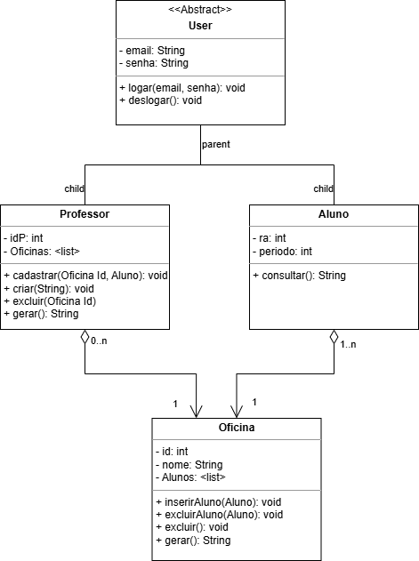
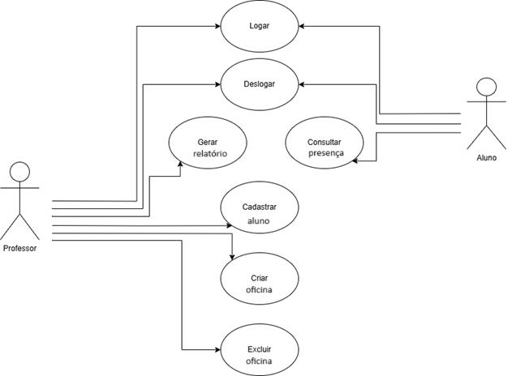

# 📘 Sistema de Registro de Presença - ELLP

Este projeto faz parte da disciplina de Oficina de Integração 2, cujo objetivo é o desenvolvimento de um sistema para o registro de presença de alunos nas oficinas do projeto de extensão **ELLP - Ensino Lúdico de Lógica e Programação**.

---

## 📌 Objetivo do Sistema

O objetivo do sistema é permitir o controle eficiente da participação dos alunos nas oficinas do projeto ELLP.
Com essa plataforma, espera-se otimizar o processo de registro de presença, garantir a organização dos dados acadêmicos e facilitar o acesso a relatórios gerenciais para os responsáveis pelas oficinas.

---

## 🛠️ Funcionalidades Planejadas

- Cadastro de alunos
- Cadastro de oficinas
- Login de administradores/professores
- Registro de presença por aluno em cada aula
- Consulta de presenças por aluno ou por oficina
- Geração de relatórios de frequência

---

## 🧱 Arquitetura do Sistema

A aplicação será desenvolvida utilizando o padrão **MVC** (Model-View-Controller), uma arquitetura que separa o sistema em três camadas principais, facilitando a organização e manutenção do código.

### 1. Model (Modelo)

A camada **Model** é responsável pela lógica dos dados da aplicação. Ela representa as entidades do sistema e contém as regras de negócio e a comunicação com o banco de dados. Os seus atributos podem ser representados pelo diagrama de classes. Essa camada é responsável pelo **CRUD** (criar, consultar, atualizar e deletar) dos dados e validar as regras de negócio.

Diagrama de Classes: modelagem das entidades (Aluno, Professor, Oficina)


### 2. View (Visão)

A camada **View** é a interface do usuário. É onde o usuário interage com o sistema, seja para registrar a presença, fazer login, visualizar relatório, etc. As ações dos usuários podem ser visto no diagrama de casos de uso. Essa camada é responsável por exibir as informações ao usuário, capturar seus inputs e enviar a ação para o controller.

Diagrama de Casos de Uso: descrição das principais interações dos usuários com o sistema


### 3. Controller (Controle)

A camada **Controller** atua como o intermediário entre o **View** e o **Model**. Ele recebe as requisições da UI, processa as ações e consulta ou atualiza os dados no **Model**, retornando a resposta para o **View**. Ele é responsável por gerenciar o fluxo da aplicação e coordenar, validar e tratar as chamadas entre o **View** e o **Model**

---

## 🧰 Tecnologias Utilizadas (MERN Stack)

| Camada             | Tecnologia            |
|--------------------|-----------------------|
| Frontend           | React                 |
| Backend            | Node.js + Express     |
| Banco de Dados     | MongoDB ou PostgreSQL |
| Testes             | Playwright, Mocha, Chai |
| Documentação       | Draw.io               |
| Controle de versão | Git + GitHub          |

---

## 🧪 Estratégia de Testes

Utilizaremos uma combinação de:

- **Testes de unidade** para validação das funções do backend (Mocha e Chai)
- **Testes de integração** para verificar o fluxo entre as camadas
- **Testes automatizados end-to-end** com Playwright para garantir a estabilidade

---

## 🔧 Ambiente de Desenvolvimento

Este repositório contém scripts de instalação automática para configurar um ambiente de desenvolvimento completo para projetos usando a MERN Stack (MongoDB, Express, React, Node.js).

### Scripts Disponíveis

#### setup.sh (Linux e macOS)

Script de configuração para ambientes Unix-like (Linux e macOS) que configura automaticamente todas as dependências necessárias.

**Recursos:**
- Detecção automática do sistema operacional (Linux ou macOS)
- Instalação do Node.js usando NVM (Node Version Manager)
- Instalação e configuração de MongoDB e/ou PostgreSQL
- Instalação do Visual Studio Code com extensões recomendadas
- Configuração do Git e GitHub CLI
- Criação de estrutura de projeto MERN opcional
- Instalação de ferramentas de teste (Playwright)

**Como usar:**
```bash
# Dar permissão de execução
chmod +x setup.sh

# Executar o script
./setup.sh

# Opções disponíveis:
./setup.sh -n  # Modo não-interativo
./setup.sh -g  # Não instalar interfaces gráficas
./setup.sh -e  # Não instalar ferramentas extras
./setup.sh -s  # Modo silencioso
./setup.sh -h  # Mostrar ajuda
```

#### setup.ps1 (Windows)

Script PowerShell equivalente para ambientes Windows que configura o mesmo ambiente de desenvolvimento usando o gerenciador de pacotes Chocolatey.

**Como usar:**
```powershell
# Verificar política de execução
Set-ExecutionPolicy -ExecutionPolicy Bypass -Scope Process

# Executar o script
.\setup.ps1

# Opções disponíveis:
.\setup.ps1 -n  # Modo não-interativo
.\setup.ps1 -g  # Não instalar interfaces gráficas
.\setup.ps1 -e  # Não instalar ferramentas extras
.\setup.ps1 -s  # Modo silencioso
.\setup.ps1 -h  # Mostrar ajuda
```

### Ferramentas Instaladas

Os scripts instalam e configuram as seguintes ferramentas:

1. **Gerenciamento de Versões e Runtime**
   - Node.js v18.17.1 (LTS)
   - NVM (Node Version Manager)
   - NPM (Node Package Manager)

2. **Bancos de Dados**
   - MongoDB v6.0
   - PostgreSQL v15
   - MongoDB Compass (GUI para MongoDB)
   - pgAdmin 4 (GUI para PostgreSQL)

3. **Ferramentas de Desenvolvimento**
   - Visual Studio Code
   - Git
   - GitHub CLI
   - Playwright
   - Draw.io Desktop

4. **Pacotes NPM Globais**
   - nodemon
   - express-generator
   - create-react-app
   - yarn

5. **Extensões do VS Code**
   - React/JavaScript: ES7 React Snippets, ESLint, Prettier
   - Node.js: NPM IntelliSense, DotENV
   - Banco de dados: MongoDB, PostgreSQL Client
   - Git: GitLens, GitHub Pull Requests
   - Teste: Playwright
   - Documentação: Draw.io Integration
   - Temas e utilidades: GitHub Theme, Material Icon Theme, etc.

### Estrutura do Projeto

Os scripts podem criar uma estrutura básica de projeto com a seguinte organização:

```
ellp-sistema-presenca/
├── frontend/         # Aplicação React
├── backend/          # API Express
│   └── test/         # Testes unitários com Mocha e Chai
├── docs/             # Documentação (diagramas, etc.)
├── .gitignore        # Configurado para Node.js/React
├── docker-compose.yml  # Configuração para MongoDB e PostgreSQL
├── .vscode/          # Configurações recomendadas para VS Code
└── README.md         # Este arquivo
```

---

## 👨‍💻 Equipe

- João Pedro Vaciloto Montilha - RA: 2348012
- Luis Henrique de Jesus Lima - RA: 2313642
- Marcus Vinícius Molina Freitas - RA: 2383969